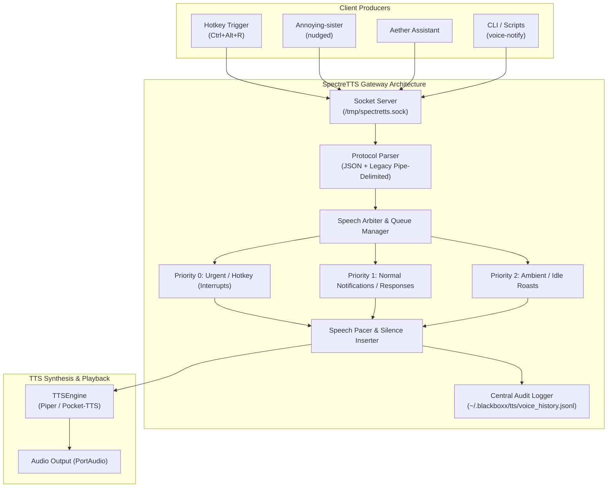

# SpectreTTS — Voice Gateway & Speech Broker Specification

> **Target Service:** `SpectreTTS` (Python Daemon)  
> **Location:** `/home/spectre/Documents/assistant/SpectreTTS/`  
> **Status:** Architecture & Implementation Reference  

---

## 1. Problem Statement

Multiple distinct assistant services running on the machine (`Annoying-sister`, `Aether`, `aximo`, global hotkeys, cron jobs, terminal CLI tools) need to synthesize speech through **SpectreTTS**.

### Current Limitations:
1. **Uncontrolled Race Conditions:** Multiple clients connecting to `/tmp/spectretts.sock` in rapid succession cause overlapping audio playback, speech truncation, or engine crashes.
2. **Lack of Priority Handling:** An urgent system alert or direct user hotkey request can be queued behind low-priority ambient or sarcastic idle roasts.
3. **No Central Auditing:** The system lacks visibility into which service spoke what message, when, and how long playback took.
4. **No Breathing Room:** Rapidly consecutive speech requests produce unbroken monotonic audio streams that sound unnatural and overwhelm the listener.

---

## 2. Architecture Overview

SpectreTTS will act as the **Central Speech Broker & Audio Arbiter** for the entire operating system.



---

## 3. Communication Protocol

SpectreTTS socket server must support both **Structured JSON** (modern, recommended) and **Legacy Pipe-delimited** commands for backwards compatibility.

### 3.1. Structured JSON Payload (Recommended)

Clients send a single JSON line:

```json
{
  "command": "speak",
  "source": "annoying-sister",
  "category": "idle_roast",
  "priority": "low",
  "text": "15 minutes idle and watching VLC. Bold strategy.",
  "interrupt": false,
  "cooldown_key": "idle_roast_vlc",
  "cooldown_seconds": 30
}
```

#### Fields:
| Field | Type | Required | Description |
|---|---|---|---|
| `command` | `string` | **Yes** | `"speak"`, `"stop"`, `"pause"`, `"resume"`, `"status"`, `"history"` |
| `source` | `string` | **Yes** | Identifier of the caller: `"annoying-sister"`, `"aether"`, `"hotkey"`, `"cli"`, `"system"` |
| `text` | `string` | Conditional | The text content to vocalize (required for `"speak"` and `"load"`). |
| `priority` | `string` | No | `"urgent"`, `"high"`, `"normal"` (default), `"low"`, `"ambient"` |
| `category` | `string` | No | Sub-classification: `"idle_nudge"`, `"user_response"`, `"notification"` |
| `interrupt` | `boolean` | No | If `true`, cancels current ongoing playback immediately and jumps to the front of the queue. Defaults to `true` for `"hotkey"` and `"urgent"`. |
| `cooldown_key`| `string` | No | Identifier used to deduplicate identical notifications. |
| `cooldown_seconds`| `int` | No | Minimum interval before another message with the same `cooldown_key` is accepted. |

### 3.2. Legacy Pipe-Delimited (Backwards Compatible)

Existing commands remain fully supported:
```
speak|Hello from SpectreTTS
stop|
pause|
resume|
voice|en_US-lessac-medium
speed|1.1
```
*Note: Legacy `speak|<text>` commands are automatically assigned `source="legacy"`, `priority="normal"`, and `interrupt=false`.*

---

## 4. Priority Tiers & Queueing Semantics

| Priority Level | Numeric Rank | Target Use Cases | Preemption Policy | Queue Capacity |
|---|---|---|---|---|
| **`urgent`** | 0 | System warnings, explicit hotkey reads (`Ctrl+Alt+R`), alarms | **Interrupts immediately.** Halts ongoing playback and speaks now. | 5 |
| **`high`** | 1 | Direct conversational responses (user asked a question in Aether). | Played immediately after current sentence finishes. | 10 |
| **`normal`** | 2 | Standard application notifications, completed task alerts. | FIFO queue with pacing pauses. | 25 |
| **`low` / `ambient`**| 3 | Sarcastic idle nudges (`Annoying-sister`), background tips. | FIFO; dropped if queue size > 5 to prevent backlog build-up. | 5 |

---

## 5. Speech Pacing & Natural Breathing Room

To prevent sentences from running into each other, the Gateway enforces a dynamic pacing interval after each synthesized utterance:

$$\text{Pacing Duration} = \text{Audio Playback Time} + \text{Breathing Silence}$$

- **Estimated Speaking Rate:** ~140 words/minute (~430ms per word).
- **Post-Speech Breathing Silence:** `800ms – 1800ms` (configurable, default `1200ms`).
- **Pacing Behavior:** The next queue item is only popped and sent to the synthesis pipeline after the preceding item has fully finished playing + breathing silence has elapsed.

---

## 6. Central Audit Logging & History

Every speech event processed by SpectreTTS is logged to a persistent, rotating audit file:
`~/.blackboxx/tts/voice_history.jsonl`

### Log Record Schema:
```json
{
  "timestamp": "2026-10-06T15:58:32.412Z",
  "event_id": "spk_8f9a2b",
  "source": "annoying-sister",
  "category": "idle_roast",
  "priority": "low",
  "text": "15 minutes idle and watching VLC.",
  "status": "completed",
  "duration_ms": 3420,
  "queue_wait_ms": 45,
  "interrupted": false
}
```

### Log File Management:
- Max file size: 10 MB.
- Rotated up to 3 archives (`voice_history.1.jsonl`, `voice_history.2.jsonl`).
- Easy inspection via `journalctl` or `jq`:
  ```sh
  tail -f ~/.blackboxx/tts/voice_history.jsonl | jq '{time: .timestamp, src: .source, msg: .text}'
  ```

---

## 7. Python Implementation Reference for SpectreTTS

Here is the recommended modular structure to add to the `SpectreTTS/engine/` package:

```
SpectreTTS/engine/
├── gateway/
│   ├── __init__.py
│   ├── arbiter.py          # Priority queue scheduler & worker thread
│   ├── audit_logger.py     # JSONL event audit logger
│   ├── models.py           # SpeechRequest dataclass & enums
│   └── rate_limiter.py     # Cooldown & deduplication manager
├── socket_server.py        # Updated to parse JSON & route to Arbiter
└── tts_engine.py           # Underlying synthesis & PortAudio stream
```

### 7.1. Data Models (`models.py`)

```python
from dataclasses import dataclass, field
from enum import IntEnum
import time
import uuid

class Priority(IntEnum):
    URGENT = 0
    HIGH = 1
    NORMAL = 2
    LOW = 3
    AMBIENT = 4

@dataclass(order=True)
class SpeechRequest:
    priority: Priority
    timestamp: float = field(compare=False)
    id: str = field(default_factory=lambda: uuid.uuid4().hex[:8], compare=False)
    source: str = field(default="unknown", compare=False)
    category: str = field(default="general", compare=False)
    text: str = field(default="", compare=False)
    interrupt: bool = field(default=False, compare=False)
    cooldown_key: str = field(default="", compare=False)
    cooldown_seconds: int = field(default=0, compare=False)
```

### 7.2. Speech Arbiter & Worker Thread (`arbiter.py`)

```python
import threading
import queue
import time
from .models import SpeechRequest, Priority
from .audit_logger import AuditLogger
from .rate_limiter import RateLimiter

class SpeechArbiter:
    def __init__(self, tts_engine, breathing_pause_sec=1.2):
        self.engine = tts_engine
        self.breathing_pause = breathing_pause_sec
        self.queue = queue.PriorityQueue()
        self.logger = AuditLogger()
        self.limiter = RateLimiter()
        self._running = False
        self._worker_thread = None
        self._lock = threading.Lock()

    def start(self):
        self._running = True
        self._worker_thread = threading.Thread(target=self._process_queue, daemon=True)
        self._worker_thread.start()

    def submit(self, req: SpeechRequest) -> bool:
        # Check rate limiter / deduplication
        if req.cooldown_key and not self.limiter.allow(req.cooldown_key, req.cooldown_seconds):
            self.logger.log_dropped(req, reason="cooldown_active")
            return False

        # Drop low priority if queue is backed up
        if req.priority >= Priority.LOW and self.queue.qsize() >= 5:
            self.logger.log_dropped(req, reason="queue_full_low_priority")
            return False

        if req.interrupt:
            self.engine.stop()  # Interrupt active audio
            # Clear pending low/normal tasks if urgent request warrants it
            if req.priority == Priority.URGENT:
                self._drain_lower_priorities()

        self.queue.put(req)
        return True

    def _drain_lower_priorities(self):
        temp = []
        while not self.queue.empty():
            try:
                item = self.queue.get_nowait()
                if item.priority <= Priority.HIGH:
                    temp.append(item)
                else:
                    self.logger.log_dropped(item, reason="preempted_by_urgent")
            except queue.Empty:
                break
        for item in temp:
            self.queue.put(item)

    def _process_queue(self):
        while self._running:
            try:
                req: SpeechRequest = self.queue.get(timeout=0.5)
            except queue.Empty:
                continue

            start_time = time.time()
            self.logger.log_start(req)

            try:
                self.engine.speak(req.text)
                # Wait for engine playback to complete
                while self.engine.is_playing() and self._running:
                    time.sleep(0.05)
                
                # Enforce breathing space before next queue item
                time.sleep(self.breathing_pause)
                self.logger.log_complete(req, duration=time.time() - start_time)
            except Exception as e:
                self.logger.log_error(req, error=str(e))
            finally:
                self.queue.task_done()
```

---

## 8. Client Utility: `voice-notify` CLI Helper

A lightweight bash / python CLI utility can be placed at `/usr/local/bin/voice-notify` or `~/.local/bin/voice-notify` for system scripts:

```bash
#!/usr/bin/env bash
# Usage: voice-notify "Build finished successfully" --source "ci" --priority "high"

TEXT="$1"
SOURCE="${2:-cli}"
PRIORITY="${3:-normal}"

JSON_PAYLOAD=$(cat <<EOF
{
  "command": "speak",
  "source": "$SOURCE",
  "priority": "$PRIORITY",
  "text": "$TEXT"
}
EOF
)

echo "$JSON_PAYLOAD" | nc -U /tmp/spectretts.sock 2>/dev/null || true
```

---

## 9. Verification & Acceptance Checklist

- [ ] **Simultaneous Client Test:** Trigger `Ctrl+Alt+R` while `nudged` fires an idle roast. Verify the hotkey interrupts or smoothly queues without clipping.
- [ ] **Burst Test:** Send 10 speech requests in rapid succession via shell loop. Verify requests are paced with ~1.2s breathing pause and do not choke.
- [ ] **Audit Log Check:** Inspect `~/.blackboxx/tts/voice_history.jsonl` to ensure all sources (`annoying-sister`, `hotkey`, `cli`) are logged with accurate timestamps.
- [ ] **Legacy Compatibility:** Run `echo -n 'speak|test' | nc -U /tmp/spectretts.sock` to confirm legacy scripts work without modification.
