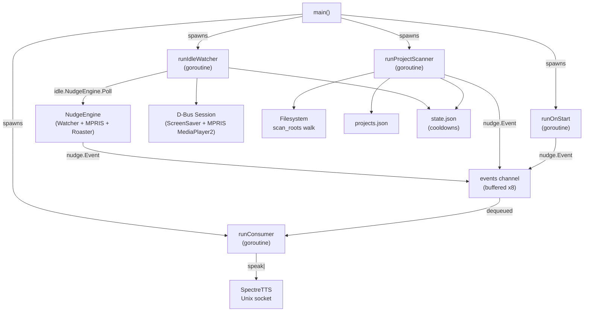

# Architecture & Data Flow

`nudged` is designed around a multi-goroutine pipeline with strict separation between pure decision logic and I/O (D-Bus, filesystem, Unix socket).

---

## Component Architecture

---

## Goroutines Overview

1. **`runIdleWatcher`**
   - Polls D-Bus `org.freedesktop.ScreenSaver` idle time at `idle_poll_interval_seconds`.
   - Uses `idle.NudgeEngine` (wrapping `idle.Watcher`, `idle.DBusMediaPlayerReader`, and `idle.Roaster`).
   - If a media player is actively playing (e.g. VLC, Spotify, browser media), dispatches a contextual roast.
   - If idle without active media playback, renders a template from `nudge.RenderIdle`.
   - Records last nudged timestamp in `state.json`.

2. **`runProjectScanner`**
   - Periodically walks `scan_roots` (skipping `ignored_paths`).
   - Identifies git repositories and computes `last_active` timestamp via recursive mtime walk.
   - Merges discoveries into `projects.json` via pure `projects.Merge`.
   - Evaluates project dormancy and fires dormant-project nudges (limited to once per calendar day per project).

3. **`runOnStart`**
   - Waits for both the initial idle poll and the initial project scan to complete.
   - Evaluates whether any project is currently dormant.
   - Emits exactly one startup greeting nudge (`nudge.RenderOnStart`).

4. **`runConsumer`**
   - The **single writer** to the SpectreTTS Unix socket (`/tmp/spectretts.sock`).
   - Ensures messages are sent sequentially without interleaved audio output.
   - Fire-and-forget per message connect/close.

---

## Key Invariants

- **Single TTS Writer:** `runConsumer` is the only goroutine that opens and writes to the SpectreTTS socket.
- **Pure Decision Logic:** `idle.Watcher.Decide`, `projects.Merge`, `projects.IsDormant`, and `nudge.Render*` are pure functions without side effects, enabling isolated unit testing.
- **Graceful Shutdown:** On `SIGINT`/`SIGTERM`, the `ctx.Done()` signal is checked between events and ticks, ensuring no mid-write interruption on the socket or disk flushes.
- **Atomic Persistence:** All JSON state files (`config.json`, `projects.json`, `state.json`) are written via `atomicfile.Write` (temp file + same-directory `os.Rename`).
