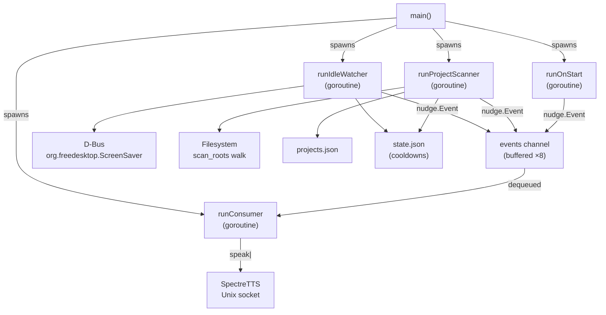

# nudged — Developer & Operator Documentation

> A long-running Go daemon that speaks idle and dormant-project nudges through **SpectreTTS**.

---

## Table of Contents

1. [What it does](#what-it-does)
2. [Architecture overview](#architecture-overview)
3. [Package reference](#package-reference)
4. [Configuration (`config.json`)](#configuration-configjson)
5. [Data files](#data-files)
6. [Logging](#logging)
7. [How to interact with the daemon](#how-to-interact-with-the-daemon)
8. [Build, test & run](#build-test--run)
9. [Deployment (systemd)](#deployment-systemd)
10. [Design decisions & trade-offs](#design-decisions--trade-offs)

---

## What it does

`nudged` monitors two things and speaks through SpectreTTS when they cross configured thresholds:

| Trigger | Condition | Cooldown |
|---------|-----------|----------|
| **Idle nudge** | You haven't touched the keyboard/mouse for `idle_threshold_minutes` | Repeats every `idle_repeat_interval_minutes` while you remain idle; resets when you come back |
| **Dormant project nudge** | A project directory in `scan_roots` hasn't had any file changes in `dormant_threshold_days` | Once per calendar day per project |
| **On-start nudge** | Fires once, after the first idle read and project scan both complete | Never repeats |

---

## Architecture overview



**Key invariants:**
- `runConsumer` is the **only** writer to the SpectreTTS socket — no interleaving.
- Decision logic (`idle.Watcher.Decide`, `projects.Merge`, `projects.IsDormant`) is **pure** — no D-Bus, no filesystem, no goroutines — making it unit-testable with plain in-memory arguments.
- Shutdown on `SIGINT`/`SIGTERM` drains cleanly: goroutines check `ctx.Done()` between events, never mid-write.

---

## Package reference

### [`cmd/nudged`](file:///home/spectre/Projects/nudge/cmd/nudged/main.go)

The program entry-point. Contains:

| Function | Purpose |
|----------|---------|
| `main()` | Initializes logger, calls `run()`, exits 1 on error |
| `run()` | Loads config/state/registry, connects D-Bus, spawns 4 goroutines, waits for shutdown |
| `runIdleWatcher()` | Polls D-Bus idle time on a ticker; uses `idle.Watcher` to decide when to fire |
| `runProjectScanner()` | Walks `scan_roots` on a ticker; merges into registry; fires dormant-project nudges |
| `runOnStart()` | Waits for first scan + first idle read to both complete, fires exactly one on-start nudge |
| `runConsumer()` | Serializes all `nudge.Event`s into the SpectreTTS socket |

---

### [`internal/logging`](file:///home/spectre/Projects/nudge/internal/logging/logging.go)

Structured logging via `log/slog`. See [Logging](#logging) section for full details.

---

### [`internal/config`](file:///home/spectre/Projects/nudge/internal/config)

Loads `~/.blackboxx/nudge/config.json`. If the file is missing, writes defaults and returns them — no crash on first run. All thresholds, intervals, and paths live here.

```go
type Config struct {
    ScanRoots                  []string
    IgnoredPaths               []string
    IdleThresholdMinutes       int
    IdleRepeatIntervalMinutes  int
    IdlePollIntervalSeconds    int
    DormantThresholdDays       int
    ProjectScanIntervalMinutes int
    SpectreTTSSocketPath       string
}
```

---

### [`internal/state`](file:///home/spectre/Projects/nudge/internal/state/state.go)

Mutex-guarded cooldown bookkeeping, atomically persisted to `state.json`.

| Method | What it tracks |
|--------|---------------|
| `IdleLastNudged()` / `SetIdleLastNudged()` | Timestamp of last idle nudge |
| `ProjectLastNudgedDate()` / `SetProjectLastNudgedDate()` | "YYYY-MM-DD" per project name |

---

### [`internal/projects`](file:///home/spectre/Projects/nudge/internal/projects)

| File | Responsibility |
|------|---------------|
| [`store.go`](file:///home/spectre/Projects/nudge/internal/projects/store.go) | Mutex-guarded `Registry` (`map[string]Project`), atomic JSON persistence |
| [`merge.go`](file:///home/spectre/Projects/nudge/internal/projects/merge.go) | Four-case merge of discovered paths into the registry (pure function) |
| [`discover.go`](file:///home/spectre/Projects/nudge/internal/projects/discover.go) | `filepath.WalkDir` over `scan_roots`, applies `ignored_paths` filter |
| [`lastactive.go`](file:///home/spectre/Projects/nudge/internal/projects/lastactive.go) | `ComputeLastActive`: walks a project tree (skipping `.git/`) and returns the newest file mtime |
| [`dormancy.go`](file:///home/spectre/Projects/nudge/internal/projects/dormancy.go) | `IsDormant`, `MostDormant` — pure time-comparison helpers |

**Merge cases (from spec):**

| Case | Situation | Action |
|------|-----------|--------|
| 1 | New path not in registry | Insert: `Source=auto`, empty summary, computed `last_active` |
| 2 | Path matches existing entry | Update `Path` + `last_active` only — summary never touched |
| 3 | Existing entry not found this cycle | Left completely untouched (absence ≠ deletion) |
| 4 | (implicit) | `Source` and `Summary` always preserved across updates |

---

### [`internal/idle`](file:///home/spectre/Projects/nudge/internal/idle)

| File | Responsibility |
|------|---------------|
| [`dbus.go`](file:///home/spectre/Projects/nudge/internal/idle/dbus.go) | `DBusReader` — connects to `org.freedesktop.ScreenSaver`, reads `GetSessionIdleTime` |
| [`decide.go`](file:///home/spectre/Projects/nudge/internal/idle/decide.go) | `Watcher.Decide()` — pure edge-detection: fires on threshold crossing, repeats while idle |

`Watcher.Decide` edge-detection logic:

```
idle < threshold  →  reset state, return false
idle ≥ threshold AND was below last poll  →  return true (first nudge of stretch)
idle ≥ threshold AND was above last poll  →  return true only if RepeatInterval elapsed
```

---

### [`internal/nudge`](file:///home/spectre/Projects/nudge/internal/nudge)

| File | Responsibility |
|------|---------------|
| [`event.go`](file:///home/spectre/Projects/nudge/internal/nudge/event.go) | `Event` struct (`Category` + `Text`), category constants |
| [`templates.go`](file:///home/spectre/Projects/nudge/internal/nudge/templates.go) | Template pools + `RenderIdle`, `RenderDormant`, `RenderOnStart` |

Template slots: `{ProjectName}`, `{IdleMinutes}`, `{DormantDays}`.

> [!NOTE]
> The template pools are explicitly marked **"rewrite before ship"** in the code — the current strings are placeholder-quality. What matters structurally is that each pool has enough variety that repeated idle firings don't feel identical.

---

### [`internal/tts`](file:///home/spectre/Projects/nudge/internal/tts/tts.go)

Fire-and-forget Unix socket client. Per-message connect/close (no persistent connection — avoids needing reconnect logic if SpectreTTS restarts).

Protocol: writes `speak|<text>` as a raw byte string to the socket, then closes.

Errors (socket missing, SpectreTTS not running) are returned to the consumer goroutine which logs a `WARN` and moves on.

---

### [`internal/paths`](file:///home/spectre/Projects/nudge/internal/paths/paths.go)

Single source of truth for the on-disk layout. Change `DataRoot` here to rename `~/.blackboxx/` globally.

| Path | Constant/Function |
|------|------------------|
| `~/.blackboxx/nudge/` | `NudgeDir()` |
| `~/.blackboxx/nudge/config.json` | `ConfigPath()` |
| `~/.blackboxx/nudge/projects.json` | `ProjectsPath()` |
| `~/.blackboxx/nudge/state.json` | `StatePath()` |

---

### [`internal/atomicfile`](file:///home/spectre/Projects/nudge/internal/atomicfile)

`Write(path, data, perm)` — writes to a temp file in the same directory, then `os.Rename`s atomically. Prevents partial writes from corrupting JSON state files.

---

## Configuration (`config.json`)

Located at `~/.blackboxx/nudge/config.json`. Created with defaults on first run.

```json
{
  "scan_roots": [],
  "ignored_paths": [],
  "idle_threshold_minutes": 20,
  "idle_repeat_interval_minutes": 20,
  "idle_poll_interval_seconds": 30,
  "dormant_threshold_days": 7,
  "project_scan_interval_minutes": 15,
  "spectretts_socket_path": "/tmp/spectretts.sock"
}
```

| Field | Default | Meaning |
|-------|---------|---------|
| `scan_roots` | `[]` | Directories to walk for project discovery. **Edit this first.** |
| `ignored_paths` | `[]` | Paths to skip during discovery (e.g. vendor, node_modules parents) |
| `idle_threshold_minutes` | `20` | Minutes of inactivity before first idle nudge |
| `idle_repeat_interval_minutes` | `20` | Minutes between repeated idle nudges while you stay idle |
| `idle_poll_interval_seconds` | `30` | How often to query D-Bus for idle time |
| `dormant_threshold_days` | `7` | Days without file changes before a project is considered dormant |
| `project_scan_interval_minutes` | `15` | How often to re-walk `scan_roots` |
| `spectretts_socket_path` | `/tmp/spectretts.sock` | Path to the SpectreTTS Unix socket |

> [!IMPORTANT]
> `nudged` does **not** hot-reload `config.json`. Restart the daemon after editing it.

---

## Data files

| File | Purpose | Edited by |
|------|---------|-----------|
| `config.json` | All thresholds, paths, intervals | **You** |
| `projects.json` | Project registry (discovered + manual entries) | Daemon (auto) + you (manual) |
| `state.json` | Cooldown timestamps | Daemon only |

### Adding a project manually to `projects.json`

The daemon never deletes entries, so you can hand-craft entries:

```json
{
  "my-project": {
    "path": "/home/spectre/Projects/my-project",
    "summary": "A brief description spoken in nudges",
    "source": "manual",
    "last_active": "2026-08-01T10:00:00Z"
  }
}
```

- `source`: `"manual"` entries are never auto-overwritten (summary is always preserved)
- `last_active`: ISO 8601 timestamp; the daemon will update it on next scan if the path is in `scan_roots`
- The map key is the **display name** spoken in nudge phrases (e.g. "my-project hasn't heard from you in 14 days")

---

## Logging

Controlled by two environment variables — **not** in `config.json` (these are operational, not user-threshold settings):

```sh
NUDGE_LOG_LEVEL=debug   # debug | info | warn | error   (default: info)
NUDGE_LOG_FORMAT=color  # text | json | color            (default: color on TTY, text otherwise)
```

### Format modes

| Format | When to use |
|--------|-------------|
| `color` | Interactive terminal use — ANSI-colored, human-readable, time shown as `HH:MM:SS` |
| `text` | `journalctl` output, log files — plain `key=value` slog text format |
| `json` | Log aggregators, `jq` pipelines — structured JSON per line |

**Auto-detection:** if `NUDGE_LOG_FORMAT` is unset and stderr is a real TTY, `color` is used automatically. Piped to `journalctl` or a file, it falls back to `text`.

### Log levels

| Level | What's logged |
|-------|--------------|
| `debug` | Poll ticks, individual decisions that didn't fire, cache hits, first-read confirmations |
| `info` | Lifecycle events (start/stop), every fired `NudgeEvent`, scan summaries, config/state loads |
| `warn` | Recoverable failures: D-Bus poll error, SpectreTTS socket unreachable (message dropped), single project `last_active` failure |
| `error` | Fatal failures: config/state/registry corrupt or unwritable, D-Bus connection failure at startup |

### Every log line has a `component` attribute

```
component=idle_watcher | project_scanner | on_start | tts_consumer | config | state | projects | main
```

Filter in journalctl:
```sh
journalctl --user -u nudged -g 'component=idle_watcher'
```

---

## How to interact with the daemon

`nudged` is **deliberately headless** — it has no IPC socket and no web UI.
All interaction is through:

### 0. Interactive setup wizard (recommended for first-time setup)

```sh
nudged -setup
```

A full-screen TUI with a directory browser on the left and your selected `scan_roots` on the right.
`Tab` to switch panels, `Enter` to add, `d`/`⌫` to remove, `s` to save & exit, `q` to cancel.

### 1. Edit `config.json` then restart

```sh
$EDITOR ~/.blackboxx/nudge/config.json
systemctl --user restart nudged
```

### 2. Edit `projects.json` to add/annotate projects manually

The daemon does an atomic replace of the file on every scan, so edit it **while the daemon is stopped** to avoid races:

```sh
systemctl --user stop nudged
$EDITOR ~/.blackboxx/nudge/projects.json
systemctl --user start nudged
```

### 3. Check logs

```sh
# Follow live with color (if running in a terminal)
NUDGE_LOG_FORMAT=color journalctl --user -u nudged -f

# All time — json for jq
journalctl --user -u nudged -o cat | jq 'select(.level == "WARN")'

# Debug mode for one session
NUDGE_LOG_LEVEL=debug NUDGE_LOG_FORMAT=color go run ./cmd/nudged
```

### 4. Silence the daemon temporarily

```sh
systemctl --user stop nudged
# ... later
systemctl --user start nudged
```

### 5. Reset cooldowns

Delete or empty `state.json` — the daemon creates a fresh one on next start:

```sh
echo '{}' > ~/.blackboxx/nudge/state.json
```

### 6. Force a nudge (manual test)

Write directly to the SpectreTTS socket:

```sh
echo -n 'speak|Hello from nudge test' | nc -U /tmp/spectretts.sock
```

---

## Build, test & run

```sh
# Build
go build ./...

# Run tests (unit only — no D-Bus, no real socket)
go test ./...

# Run directly (color logs auto-enabled on TTY)
go run ./cmd/nudged

# Run with debug output
NUDGE_LOG_LEVEL=debug go run ./cmd/nudged

# Force plain text (e.g. if piping stderr)
NUDGE_LOG_FORMAT=text go run ./cmd/nudged 2> nudge.log
```

---

## Deployment (systemd)

```sh
# Build binary
go build -o ~/.local/bin/nudged ./cmd/nudged

# Install service unit
mkdir -p ~/.config/systemd/user
cp systemd/nudged.service ~/.config/systemd/user/

# Enable and start
systemctl --user daemon-reload
systemctl --user enable --now nudged

# Check status
systemctl --user status nudged
journalctl --user -u nudged -f
```

The [unit file](file:///home/spectre/Projects/nudge/systemd/nudged.service) uses `After=graphical-session.target` (so D-Bus is available) and `Restart=on-failure` with a 5s back-off.

> [!TIP]
> Add `Environment=NUDGE_LOG_LEVEL=debug` to the `[Service]` section of the unit file for persistent debug logging, or pass it as a transient override: `systemctl --user set-environment NUDGE_LOG_LEVEL=debug`.

---

## Design decisions & trade-offs

| Decision | Choice | Rationale |
|----------|--------|-----------|
| New project display name | `filepath.Base(path)` | Rename one call site in `merge.go` (`uniqueKey`/`filepath.Base`) if you want richer auto-names |
| Default `scan_roots` | Empty `[]` | The spec's example hardcodes `/home/maximus/projects` — wrong for everyone else |
| SpectreTTS connection | Per-message connect/close | Simplest; no reconnect logic needed when SpectreTTS restarts |
| Key collisions | `-2`, `-3` suffix | Two scan_roots with same-named subdirectories get `name` and `name-2` |
| No hot-reload | Restart required | Avoids SIGHUP handler complexity; config changes are infrequent |
| Shutdown | `ctx.Done()` checked between events only | Spec requirement: never interrupt a mid-write to the socket |
| Color logging | `lmittmann/tint` | Zero-dep, drop-in `slog.Handler`; auto-disabled when stderr isn't a TTY |
